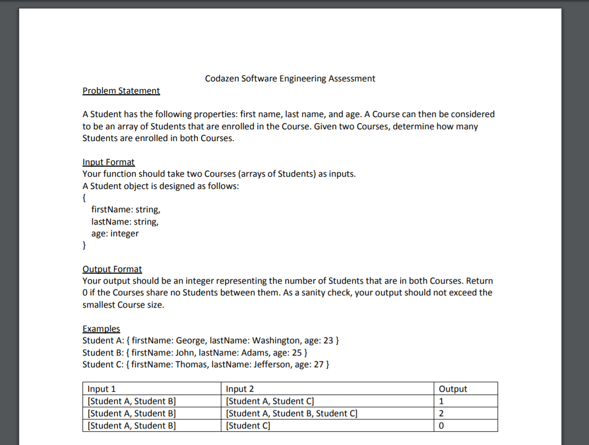
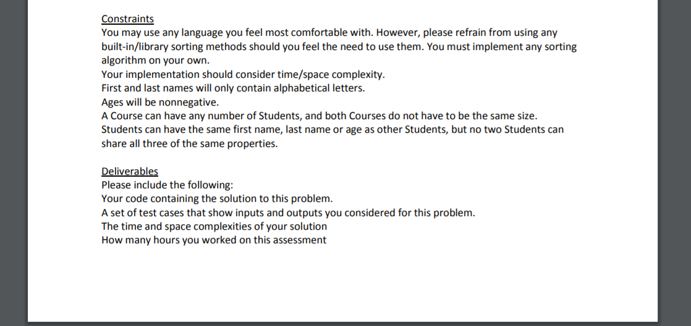

# JavaTest

Solution: 
1. Created a tool file to read student names from systems.
2. Implemented quick sort for Student class.
3. Test everything in Junit.

In "java" directory, I stored 4 classes:

"fileTool" for upload and read student information from txt file.

"Class" for class object, "Student" for student Object.

"Solution" for solving this test, which contains quicksort and other implementation.

In "resources" directory, you can find the sample student info.

In "test" directory, I used JUnit to implement Unit test. To save your time, you can run "testQuickSort"

and "TestResult". 

If you still have questions please feel free to contact me.

Thanks

Test Requirement: 
 

